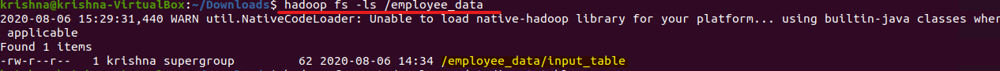

# SQOOP Export data from HDFS to MySQL
-----------------------

### MapReduce

Sqoop is a command-line interface application for transferring data between relational databases and Hadoop.  

### Pros
* It involves transferring data from a variety of structured sources of data like Oracle, Postgres, etc.  
* The data transfer is in parallel, making it fast and cost-effective.  
* A lot of processes can be automated, bringing in heightened efficiency.  
* It is possible to integrate with Kerberos security authentication.  

### Input Directory
Input directory contains input table that will be uploaded to Sqoop.  

  

In the above screenshot, we can see an input directory (employee_data) contains input file – employee_data.  

### Input_table

  

In the above screenshot, we can see that input contains employee_id, Name & Salary data.  

### Create Database employeedb

  

In the above screenshot, we can see the employeedb is created.  

### Create Table employee

  

In the above screenshot, we can see the schema of the employee table.  

### Command to export data from hdfs to mysql
 
  

**sqoop export -** export to sqoop  
**-m 1 -** number of mapper run 1  
**Jdbc:mysql://localhost/employeedb –** Connection to the database employeedb  
**--username –** mysql username to verify that user has write access or not  
**--table –** mysql table name  
**--export-dir –** where data have to pick to insert into mysql  

### Verify data in MySQL
 
  

In the above screenshot, we can see that employee table contains all 4 rows.  

### Some Basic Operations:

### 1.	Count records in employee table

  

In the above screenshot, we can see that count is 4.  

### 2.	Select top 2 rows

  
 
In the above screenshot, top 2 records are printed on the screen.  

**Created by:**  
**Name: Krishna Kumar Singh**  
**Email: krishnaai265@gmail.com**  
**Phone: +91-9368754996** 
